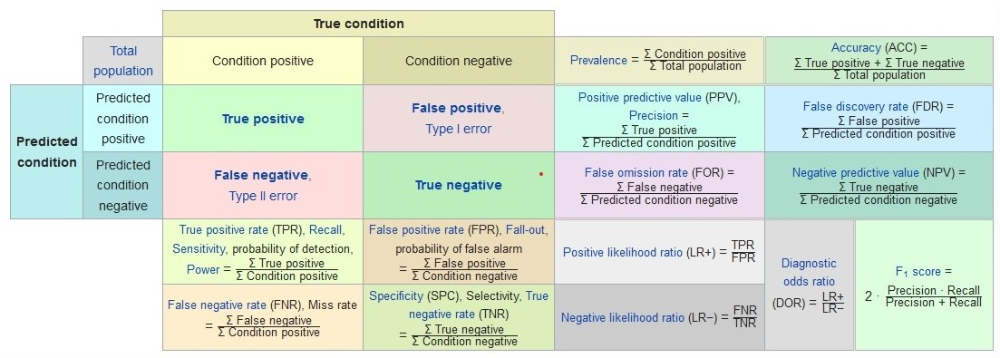

```{r setup, include=FALSE}
knitr::opts_chunk$set(echo = FALSE)
```

## Packages
```{r echo=TRUE, message=FALSE, warning=FALSE}

package_name = c('e1071', 'klaR', 'dplyr', 'DT')
for(p in package_name) {
  if(! p %in% rownames(installed.packages())){
    cat('Try to install ', p, 'now !\n')
    tryCatch({
      install.packages(p)
    }, error = function(e) {
      print(e)
      conditionMessage(e)
    })
  }else{
    cat(p, 'has been installed !\n')
  }
}

```

## Library
```{r echo=TRUE, message=FALSE, warning=FALSE}
library(dplyr)
library(e1071)
library(klaR)
library(DT) # Datatable
```


## Contingency Table

{width=100%}

```{r}

model_performance <- function(predict_condition, true_condition){
  # Confusion Matrix, Contingency Table
  confusion_matrix <- table(predict_condition, true_condition)
  print(confusion_matrix)
  
  # Hit, True Positive
  TP <-  confusion_matrix[1,1]
  # Correct Rejection, True Negative
  TN <- confusion_matrix[2,2]
  # False Alarm, Type I Error, False Positive
  FP <-  confusion_matrix[1,2]
  # Miss, Type II Error, False Negative
  FN <-  confusion_matrix[2,1]
  
  
  
  # Sensitivity, Recall, True Positive Rate
  TPR <- TP / (TP + FN)
  
  # Specificity, Selectivity, True Negative Rate
  TNR <- TN / (TN + FP)
  
  # Precision, Positive Predictive Value
  PPV <- TP / (TP + FP)
  
  # Negative Prediction Value
  NPV <- TN / (TN + FN)
  
  # Miss Rate, False Negative Rate
  FNR <- FN /(FN + TP)
  
  # Fall Out, False Positive Rate
  FPR <-  FP / (FP + TN)
  
  # False Discovery Rate
  FDR <- FP / (FP + TP)
  
  # False Omission Rate
  FOR <- FN / (FN + TN)
  
  
  # Threat Score, Critical Success Index
  TS <- TP / (TP + FN + FP)
  
  # Accuracy
  ACC <- (TP + TN) / sum(confusion_matrix)
  
  # Balanced Accuracy, Harmonic Mean of Precision and Sensitivity
  BA <- (TPR + TNR) / 2
  
  # F1 Score
  F1 <- 2*(PPV*TPR)/(PPV+TPR)
  
  # Matthews correlation coefficient
  MCC <- (TP*TN -FP*FN) / sqrt((TP+FP)*(TP+FN)*(TN+FP)*(TN+FN))
  
  # 
  
}

```

  
  
  
[Reference : Sensitivity and specificity](https://en.wikipedia.org/wiki/Sensitivity_and_specificity)


## Slide with R Output

```{r cars, echo = TRUE}
data('Titanic') # Its class is table. 
df_Titanic = data.frame(Titanic)
datatable(df_Titanic, options = list(pageLength = 5))

```

## Questions

+ Is  **Sirvived** correlated with **Class**, **Sex**, or **Age** ?
  1. Do those in 1st class have more survival probability?
  2. Do the female survived more than the male?
  3. Are children prior to be rescued?
  
+ Are **Class**, **Sex**, and **Age** independent variables ?


+ Is it possible to describe the relationship of these explanatory and explained variables?


## Raw data

```{r echo=TRUE}

repeating_sequence <- rep(1:nrow(df_Titanic), df_Titanic$Freq)
rawdata <- df_Titanic[repeating_sequence,]
rawdata$Freq <- NULL # delete Freq column

nrow(df_Titanic) # Titanic is an aggregation data
nrow(rawdata) 

```

## Naive Bayes Model

```{r echo=TRUE}
# laplace: laplace smoothing
# type: output type, show class or raw probability.
# threshold: ...
# na.action: process NA

model_NaiveBayes =  naiveBayes(
  formula = Survived ~ .,
  data = rawdata)

```


##

```{r}
model_NaiveBayes
```


```{r}
pred_NaiveBayes <- predict(model_NaiveBayes,rawdata) # predict survived
Titanic_survived <- rawdata$Survived # real survived


```


